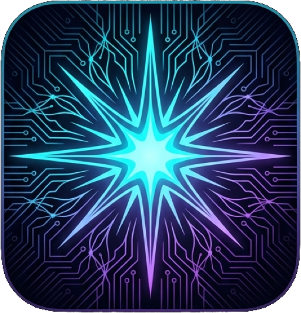

<p align="center">
  
</p>

<h1 align="center">NovaMLX</h1>

<p align="center"><strong>The blazing fast pure-Swift LLM/VLM server for Apple Silicon.<br>No Python. No cloud. No limits.</strong></p>

<p align="center">
Run 50+ model families — Llama, Qwen, Gemma, DeepSeek, Mistral — natively on your Mac.<br>
100% Swift. Zero Python dependencies. OpenAI & Anthropic compatible. Native menu bar app.
</p>

<p align="center">


</p>

---

## Install

**Option 1: Homebrew** (recommended)

```bash
brew tap cnshsliu/novamlx
brew install novamlx
brew services start novamlx
```

**Option 2: Download DMG**

Go to [Releases](https://github.com/cnshsliu/novamlx/releases) and download the latest `NovaMLX-X.X.X-arm64.dmg`:

1. Open the `.dmg` file
2. Drag **NovaMLX** to your **Applications** folder
3. Launch NovaMLX — the menu bar icon appears and the server starts on `localhost:8080`

**Option 3: Build from source**

```bash
git clone https://github.com/cnshsliu/novamlx.git
cd novamlx
./build.sh -c release
```

> Requires macOS 15 (Sequoia), Apple Silicon, and Xcode 16+.

---

## Quick Start

### 1. Start the server

Launch **NovaMLX** from your Applications folder (or Spotlight).

A **menu bar icon** appears. The server runs on `localhost:8080`.

### 2. (Optional) Add `nova` CLI to your PATH

The `nova` CLI is bundled inside the app. Symlink it for easy access:

```bash
sudo ln -s /Applications/NovaMLX.app/Contents/MacOS/nova /usr/local/bin/nova
```

### 3. Download a model

```bash
nova download mlx-community/Meta-Llama-3.1-8B-Instruct-4bit
```

### 4. Load it

```bash
nova load mlx-community/Meta-Llama-3.1-8B-Instruct-4bit
```

### 5. Use it

```bash
# Interactive chat
nova chat

# Or via API
curl http://localhost:8080/v1/chat/completions \
  -H "Content-Type: application/json" \
  -d '{"model":"mlx-community/Meta-Llama-3.1-8B-Instruct-4bit", \
       "messages":[{"role":"user","content":"Write a haiku about coding."}]}'
```

That's it. You're running an LLM locally.

---

## Use with Your Tools

NovaMLX is fully OpenAI API compatible. Point any tool at `http://localhost:8080/v1`.

### Claude Code

```bash
ANTHROPIC_BASE_URL=http://localhost:8080/v1 \
ANTHROPIC_API_KEY=unused \
claude
```

Or in your shell profile:

```bash
export ANTHROPIC_BASE_URL=http://localhost:8080/v1
export ANTHROPIC_API_KEY=unused
```

### OpenCode

Add to your opencode config (`~/.config/opencode/config.json`):

```json
{
  "provider": {
    "name": "openai",
    "baseURL": "http://localhost:8080/v1",
    "apiKey": "unused",
    "models": {
      "default": "mlx-community/Meta-Llama-3.1-8B-Instruct-4bit"
    }
  }
}
```

### Agent Context Scaling (automatic)

When using local models with AI coding agents (Claude Code, OpenCode, OpenClaw, Hermes), the model's context window is often smaller than Anthropic's 200K. NovaMLX **auto-detects** agent tools from their HTTP headers and scales reported token counts so that auto-compact triggers at the right time — before your local model runs out of context. Normal chat clients (curl, Python SDK, web UI) always get real token counts.

**No setup needed.** Detection is automatic via `Anthropic-Version` header (Claude Code) or `User-Agent` substring matching (OpenCode, OpenClaw, Hermes).

Set `contextScalingTarget` in `~/.nova/config.json` to enable:

```json
{
  "server": {
    "host": "127.0.0.1",
    "port": 8080,
    "adminPort": 8081,
    "apiKeys": [],
    "contextScalingTarget": 200000
  }
}
```

If your model has a 128K context window and `contextScalingTarget` is 200000, token counts are scaled by `200000 / 128000 = 1.56×` — but **only for detected agent tools**. If `contextScalingTarget` is omitted, no scaling occurs (default).

> **How it works:** Claude Code and other agents auto-compact conversation history at ~80% of what they believe the context window to be. By scaling the usage numbers, NovaMLX ensures that 80% of the virtual window maps to the actual limit of your local model, preventing context overflow errors.

### Cursor

Settings → Models → OpenAI API Compatible:

| Field    | Value                                           |
| -------- | ----------------------------------------------- |
| Base URL | `http://localhost:8080/v1`                      |
| API Key  | `unused`                                        |
| Model ID | `mlx-community/Meta-Llama-3.1-8B-Instruct-4bit` |

### Continue.dev

Add to `~/.continue/config.json`:

```json
{
  "models": [
    {
      "title": "NovaMLX Local",
      "provider": "openai",
      "apiBase": "http://localhost:8080/v1",
      "apiKey": "unused",
      "model": "mlx-community/Meta-Llama-3.1-8B-Instruct-4bit"
    }
  ]
}
```

### Python (OpenAI SDK)

```python
from openai import OpenAI

client = OpenAI(base_url="http://localhost:8080/v1", api_key="unused")

response = client.chat.completions.create(
    model="mlx-community/Meta-Llama-3.1-8B-Instruct-4bit",
    messages=[{"role": "user", "content": "Hello!"}],
    stream=True
)

for chunk in response:
    if chunk.choices[0].delta.content:
        print(chunk.choices[0].delta.content, end="")
```

### Python (Anthropic SDK)

```python
import anthropic

client = anthropic.Anthropic(base_url="http://localhost:8080", api_key="unused")
response = client.messages.create(
    model="mlx-community/Meta-Llama-3.1-8B-Instruct-4bit",
    max_tokens=1024,
    messages=[{"role": "user", "content": "Hello!"}]
)
print(response.content[0].text)
```

### cURL / Any HTTP Client

```bash
# Chat
curl http://localhost:8080/v1/chat/completions \
  -H "Content-Type: application/json" \
  -d '{"model":"my-model","messages":[{"role":"user","content":"Hi"}]}'

# Streaming
curl http://localhost:8080/v1/chat/completions \
  -H "Content-Type: application/json" \
  -d '{"model":"my-model","messages":[{"role":"user","content":"Hi"}],"stream":true}'

# Embeddings
curl http://localhost:8080/v1/embeddings \
  -H "Content-Type: application/json" \
  -d '{"model":"my-embed-model","input":"Hello world"}'
```

---

## Managing Models with `nova`

The `nova` CLI lets you manage everything from the terminal:

```bash
# Find models
nova search "llama 3.1 4bit"

# Download
nova download mlx-community/Meta-Llama-3.1-8B-Instruct-4bit

# Load into memory
nova load mlx-community/Meta-Llama-3.1-8B-Instruct-4bit

# List loaded models
nova models

# Unload (free memory)
nova unload mlx-community/Meta-Llama-3.1-8B-Instruct-4bit

# Delete downloaded files
nova delete mlx-community/Meta-Llama-3.1-8B-Instruct-4bit

# Chat interactively
nova chat

# Server status & GPU memory
nova status
```

### KV Quantization (TurboQuant)

Compress the KV cache to serve longer contexts:

```bash
# Enable 4-bit KV quantization (recommended)
nova turboquant my-model 4

# Enable 2-bit (maximum compression)
nova turboquant my-model 2

# Disable
nova turboquant my-model off

# Check status
nova turboquant
```

### Other Commands

```bash
# Sessions
nova sessions              # List active sessions
nova sessions delete ID    # Delete a session

# Cache
nova cache my-model        # Show cache stats
nova cache my-model clear  # Clear cache

# LoRA adapters
nova adapters              # List loaded adapters
nova adapters load /path/to/adapter
nova adapters unload my-adapter

# Benchmark
nova bench start my-model  # Run performance benchmark
nova bench status          # Check benchmark progress
```

---

## Managing via GUI

### macOS Menu Bar App

When you start `NovaMLX`, a menu bar icon appears showing:

- Server status (running/stopped)
- Loaded models
- GPU memory usage
- Active requests
- Tokens per second

Click the icon to open the **Dashboard** window for detailed monitoring.

### Built-in Web UIs

- **Chat**: [http://localhost:8080/chat](http://localhost:8080/chat) — Chat with your models in the browser
- **Admin Dashboard**: [http://localhost:8081/admin/dashboard](http://localhost:8081/admin/dashboard) — Monitor and manage everything

---

## What Can NovaMLX Do?

### 50+ Model Architectures

Works with any SafeTensors model from HuggingFace — Llama 3, Qwen 2/2.5/3, Gemma 2/3, Phi 3.5/4, Mistral, Mixtral, DeepSeek, StarCoder2, and many more.

### Vision (VLM)

Send images with your messages — supports Qwen2-VL, Gemma3, LLaVA, Phi-3-Vision, Pixtral, Molmo, and others:

```python
response = client.chat.completions.create(
    model="mlx-community/Qwen2.5-VL-7B-Instruct-4bit",
    messages=[{
        "role": "user",
        "content": [
            {"type": "text", "text": "What's in this image?"},
            {"type": "image_url", "image_url": {"url": "https://example.com/photo.jpg"}}
        ]
    }]
)
```

### Structured Output

Force the model to output valid JSON matching your schema:

```python
response = client.chat.completions.create(
    model="my-model",
    messages=[{"role": "user", "content": "Who won the 2022 World Cup?"}],
    response_format={
        "type": "json_schema",
        "json_schema": {
            "name": "answer",
            "schema": {
                "type": "object",
                "properties": {
                    "winner": {"type": "string"},
                    "score": {"type": "string"}
                },
                "required": ["winner", "score"]
            }
        }
    }
)
# Returns: {"winner": "Argentina", "score": "3-3 (4-2 pens)"}
```

Also supports: JSON mode, Regex patterns, and GBNF grammars.

### Tool Calling

Automatic tool call detection across 7 format families — works with any model without fine-tuning.

### Embeddings & Reranking

```bash
# Embeddings for RAG/semantic search
curl http://localhost:8080/v1/embeddings \
  -d '{"model":"my-embed-model","input":"Hello world"}'

# Rerank documents
curl http://localhost:8080/v1/rerank \
  -d '{"model":"my-reranker","query":"What is MLX?","documents":["doc1","doc2"]}'
```

### Audio (STT/TTS)

Uses Apple's built-in on-device speech recognition and synthesis:

```bash
# Speech-to-text
curl http://localhost:8080/v1/audio/transcriptions -F "file=@recording.wav"

# Text-to-speech
curl http://localhost:8080/v1/audio/speech \
  -d '{"model":"tts","input":"Hello!","voice":"Samantha"}'
```

### Both OpenAI and Anthropic APIs

Same server, both APIs:

| API                | Endpoint                    |
| ------------------ | --------------------------- |
| OpenAI Chat        | `POST /v1/chat/completions` |
| OpenAI Completions | `POST /v1/completions`      |
| OpenAI Responses   | `POST /v1/responses`        |
| OpenAI Embeddings  | `POST /v1/embeddings`       |
| Anthropic Messages | `POST /v1/messages`         |

### Agent-Aware Token Scaling

Automatically detects AI coding agents (Claude Code, OpenCode, OpenClaw, Hermes) from request headers and scales reported token counts so auto-compact triggers at the right time for local model context windows. Normal chat clients get real token counts — no configuration needed. [See details →](#agent-context-scaling-automatic)

---

## Supported Models

Any SafeTensors model from HuggingFace in 4-bit, 8-bit, or FP16. Popular choices:

| Model          | Size    | Download Command                                              |
| -------------- | ------- | ------------------------------------------------------------- |
| Llama 3.1 8B   | ~4.5 GB | `nova download mlx-community/Meta-Llama-3.1-8B-Instruct-4bit` |
| Qwen 2.5 7B    | ~4.5 GB | `nova download mlx-community/Qwen2.5-7B-Instruct-4bit`        |
| Gemma 2 9B     | ~5.5 GB | `nova download mlx-community/gemma-2-9b-it-4bit`              |
| Phi 3.5 Mini   | ~2 GB   | `nova download mlx-community/Phi-3.5-mini-instruct-4bit`      |
| Mistral 7B     | ~4 GB   | `nova download mlx-community/Mistral-7B-Instruct-v0.3-4bit`   |
| Qwen 2.5 VL 7B | ~4.5 GB | `nova download mlx-community/Qwen2.5-VL-7B-Instruct-4bit`     |

Search for more: `nova search "your model name"`

---

## Configuration

### Environment Variables

```bash
# API authentication (optional — no auth when empty)
export NOVAMLX_API_KEYS='["sk-your-key"]'
```

### Per-Model Settings

```bash
# Via API
curl -X PUT http://localhost:8081/admin/models/my-model/settings \
  -d '{"temperature": 0.7, "max_context_window": 8192, "kv_bits": 4}'
```

### Config File

`~/.config/opencode/config.json`:

```json
{
  "host": "127.0.0.1",
  "port": 8080,
  "adminPort": 8081,
  "apiKeys": []
}
```

---

## Requirements

- **macOS 15.0** (Sequoia) or later
- **Apple Silicon** Mac (M1, M2, M3, M4)
- **16 GB RAM** recommended (8 GB works for smaller models)

---

## For Developers

See [DEVELOPMENT.md](DEVELOPMENT.md) for:

- Architecture overview (11-module design)
- Building from source
- Running tests
- Creating releases
- API reference (all 40+ endpoints)

---

## License

[MIT](LICENSE)
